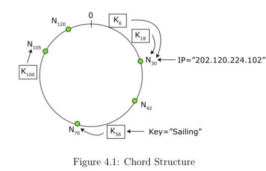
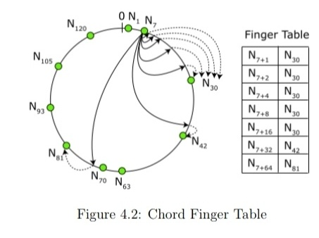
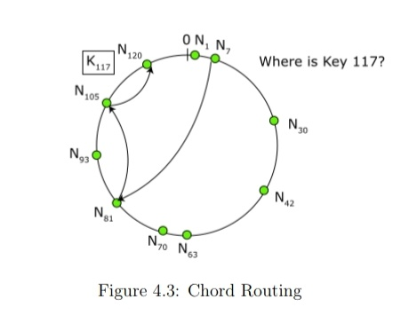

# CHORD Peer-To-Peer Protocol

This project aims to implement the Chord protocol, and offer it as an API for high level software.

# Introduction

Chord is a protocol used for resource discovery on a distributed, P2P network. It is used to locate
peers and files stored on the network, without having to request them from a central server. Each
query sent across the network resolves within O(Log n) network calls. This allows the network to
scale effortlessly.

# Organization of the network

Each node has a unique identifier. The node's IP and port address are used to calculate this ID.
The string containing IP and the PORT address in the following manner - IP_ADDRESS:PORT are hashed together using a collision resistant hash function. The hashed value is represented as
an integer for comparing node IDs, which is required during routing, as explained further. This value
is then modded with the expected number of entities, that will be present in the network. The entities
can either be nodes or data. In this implementation, SHA-1 has been used for hashing.

For eg, if the expected size of the network is, say, n = 2^m, where 'm' is an integer, then each nodeID
is calculated by computing the node hash, modulo 2^m. The output of SHA-1 will be a 160-bit hash value, which
when converted to an integer will have a value ranging from 0 to 2^160. This will be the theoretical limit
for the number of permissible entitities on the network.

< The reason for taking the mod >

The Nodes are arranged in a circular fashion, with each node storing information about its successor
and predecessor nodes. If N0 is N1's predecessor and N2 is its successor, then, nodeID(N0) < nodeID(N1) < nodeId(N2).
There is a possibility that two nodes might have the same nodeID, but it is highly unlikely for a
sufficiently large value of 'm'.

< insert explanation >

The data and nodes are both entities on the network and have undistinguishable nodeIDs. The
data entities are stored on the node whose nodeID is the successor of the enitity's nodeID.

	

# Routing

The whole network is organised in such a way, that the knowledge of the entire network, is not
required to route a query to its destination. Therefore each node can get away with just storing
information of a part of the network.

## Types of queries:
1. locating a node
	This will return the metadata of the required node, which can be used to connect/communicate
	with the node.
2. locating a data item, which can then be transferred directly, via a p2p communication.

Although the 2 queries are different, they both involve finding the sucessor of a given key 'K',
since all the data items are stored on the node, whose ID is the successor of K.

## Trivial Method
A trivial way to route queries would be send the query out, along the network, in a circular fashion, 
until you reach the desired node, having the data you want to query, or having the info about the 
node's metadata you want to retrieve. But this will have a asymptotic run time of O(N). And since 
n can very large, i.e of the order 2^160 (the theoretical limit of SHA-1). Hence this form of routing
is not feasible.

## Efficient Method
Each node, along with a successor and a predecessor, also maintains a finger table (or a routing table.
The entries in the finger table are stored in the following way:

	

This way, each query is not routed to the immediate sucessor, but to the "closest preceding node".
The finger table is searched and the node with the id closest, but lower than the destination id is selected,
and the query is forwarded to this node. And this way, the query resolves when the destination node is reached.

	

It can be proved that, in a N-node network, a query can be resolved, with high probability, by making log(N) network calls.
